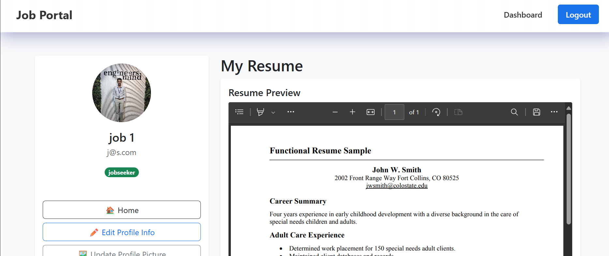

# 💼 MERN Job Portal

A full-stack job portal built with the MERN stack (MongoDB, Express, React, Node.js) featuring role-based login for recruiters and job seekers, job posting & filtering, resume upload, and more.

---

## 📸 App Screenshots

### 1️⃣ Home Page (Without Login)
> This is the landing page accessible to all users. It shows the latest job postings and allows filtering by job title, category, and location.


---

### 2️⃣ Filter Functionality
> Users can search and filter jobs using the job title, location, and category options. Results update dynamically.


---

### 3️⃣ Recruiter Login
> Login page with role selection. Logging in as a recruiter gives access to the recruiter dashboard.


---

### 4️⃣ Recruiter Dashboard (All Features)
> Recruiters can:
> - View profile picture dropdown
> - Update profile information
> - Create new job posts
> - View, edit, or delete their posted jobs


---

### 5️⃣ Job Seeker Login
> Logging in as a job seeker redirects to a personalized dashboard where they can view and manage job applications.


---

### 6️⃣ Job Seeker Dashboard (All Features)
> Job seekers can:
> - View jobs applied
> - Upload resume
> - Update profile info
> - View saved/applied jobs



---

### 7️⃣ Edit Job Page (Recruiter & Job Seeker)
> Both recruiters and job seekers have dedicated pages for editing their respective content.

- Recruiters can edit job listings.
- Job seekers can update their resume or personal info.


---

### 8️⃣ Update Profile Page (Job Seeker & Recruiter)
> Profile update screen where users can edit their name, profile picture, and other details.


---

## 🛠️ Tech Stack

- **Frontend:** React.js, Bootstrap
- **Backend:** Node.js, Express.js
- **Database:** MongoDB
- **Authentication:** JWT, bcrypt
- **State Management:** Redux Toolkit + Redux Persist

---

## 🚀 Run the App

```bash
# Backend
cd server
npm install
npm run dev

# Frontend
cd client
npm install
npm start
